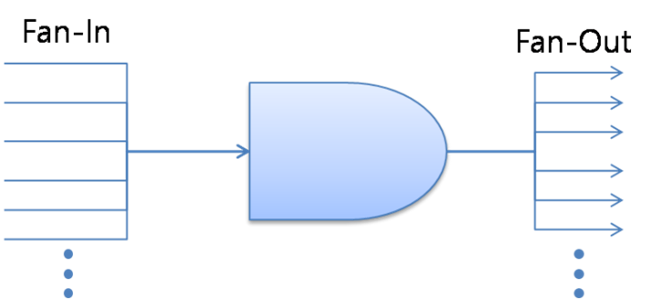

# Leerstof ondersteunende vragen

## Inhoudstafel

- [Leerstof ondersteunende vragen](#leerstof-ondersteunende-vragen)
  - [Inhoudstafel](#inhoudstafel)
  - [Hoofdstuk 1: Inleiding](#hoofdstuk-1-inleiding)
  - [Hoofdstuk 2: Digitaal rekenen](#hoofdstuk-2-digitaal-rekenen)
  - [Hoofdstuk 3: Algebra van Boole](#hoofdstuk-3-algebra-van-boole)
  - [Hoofdstuk 4: Bistabiele elementen](#hoofdstuk-4-bistabiele-elementen)
  - [Hoofdstuk 5: Registers](#hoofdstuk-5-registers)
  - [Hoofdstuk 6: Tellers](#hoofdstuk-6-tellers)
  - [Hoofdstuk 7: sequentiële systemen](#hoofdstuk-7-sequentiële-systemen)

## Hoofdstuk 1: Inleiding

Wat beschrijft het **theorema van Shannon** met betrekking tot het bemonsteren van analoge signalen?

> Het Shannon-theorema stelt dat de bemonsteringsfrequentie (fs) van een analoog signaal minstens twee keer zo hoog moet zijn als de hoogste frequentiecomponent (fmax) in dat signaal.
>
> Dit kan worden uitgedrukt als: fs ≥ 2 \* fmax. Met andere woorden, de bemonsteringsfrequentie moet voldoen aan of groter zijn dan twee keer de hoogste frequentie van het analoge signaal om een nauwkeurige digitale reconstructie zonder verlies van informatie mogelijk te maken.

Wat betekent **aliasing** met betrekking tot het bemonsteren van analoge signalen?

> Aliasing treedt op als de bemonsteringsfrequentie te laag is. Hierdoor kan het gereconstrueerde digitale signaal niet nauwkeurig overeenkomen met het oorspronkelijke analoge signaal.

Wat is **positieve logica**?

> Een logische `0` word voorgesteld met een lage spanning, lage stroom. Een logische `1` word voorgesteld door een hoge spanning, hoge stroom.

Wat is **negatieve logica**?

> Een logische `0` word voorgesteld met een hoge spanning, hoge stroom. Een logische `1` word voorgesteld door een lage spanning, lage stroom.

Verklaar de betekenis van volgende parameters en wat is de waarde voor **TTL**?

> Er van uitgaande dat er gewerkt word met positive logica:
>
> - VOHmin : '_Output High min_' : 2,4V is de minimale waarde dat de output nodig heeft om nog hoog niveau te geven.
> - VOLmax : '_Outpul Low max_' : 0,4V is de maximale waarde dat de output nodig heeft om nog laag niveau te geven.
> - VIHmin : '_Input High min_': 2,0V is de minimale waarde dat de input nodig heeft om nog hoog niveau te ontvangen.
> - VILmax : '_Input Low max_' : 0,8V is de maximale waarde dat de input nodig heeft om nog een laag te ontvangen.

Wat is de **ruismarge** bij TTL en hoeveel is dit voor de hoge en lage niveaus?

> De ruismarge is het verschil tussen de minimumwaarde van de hoge spanningsniveaus aan de in- en uitgang maar ook het verschil tussen de maximumwaarde van de lage spanningsniveaus aan de in- en uitgang.
>
> Ruismarge= VOHmin - VIHmin (2,4V - 2,0V) hoog niveau, logische `1`
>
> Ruismarge= VOLmax – VIHmax (0,8V – 0,4V) laag niveau, logische `0`
>
> Wat betekent dat binnen de ruismarge een signaal als hoog wordt geïnterpreteerd als de spanning hoger is dan 2,0V en als laag wordt beschouwd als de spanning lager is dan 0,8V.

Wat is de **statische vermogendissipatie** van een digitale poort?

> Dit is het vermogen dat opgenomen wordt door een poort als men aan de ingang een blokgolf aanlegt met
een ‘duty cycle’ van 50%. Concreet betekent dit dat de tijd waarin VIN hoog is, even lang duurt als het laag niveau van VIN.

Wat is het **power delay product** en wat omschrijft deze parameter?

> Het is het product van het verbruikte statische vermogen en de poortvertragingstijd tpd (propagation delay time)
>
> Deze parameter bepaald de kwaliteit van de logische poort.
>
> De moeilijkheid is een grote snelheid bij een laag vermogen te bereiken.
> Het is eenvoudig om een kleine tpd te verkrijgen, als men de voedingsspanning VCC sterk vergroot. Daardoor zal het vermogen echter ook stijgen!

Wat beschrijven de parameters **fan-in**, **fan-out**?

> Fan-out van een poort is het aantal poort-ingangen dat wordt aangestuurd door de uitgang van die poort.
>
> Fan-in geeft aan hoeveel standaard ingangen evenveel stroom verbruiken of leveren als de beschouwde ingang van de poort. De fan-out is altijd groter of gelijk aan de totale fan-in van de volgende trap.
> 

Wat doe je met **ongebruikte ingangen** en **ongebruikte uitgangen**? Waarom?

> **Ongebruikte ingangen** hang je best met een pull down weerstand aan een logische `0` of met een pull up weerstand aan een logische `1`. Zo voorkom je ongewenste schakelingen via storingen.
>
> **Ongebruikte uitgangen** worden opengelaten.

Wat is **ontkoppelen** van de voeding van logische bouwstenen?

> Om storingen in schakelingen met CMOS en TTL op te vangen, worden condensatoren (10nF tot 100nF) geplaatst voor elke twee of vier componenten. Deze dienen dichtbij het IC te zijn voor optimale filtering en stabiliteit.

Bespreek een nuttige toepassing voor poorten met **tri-state** uitgang.

> De CPU, het geheugen en de USB-ingangspoort van een pc werken met tri-state uitgangen voor de microprocessorbus. Om conflicten te voorkomen, worden de geheugenpoorten hoogimpedant wanneer data van USB naar CPU wordt gestuurd, en omgekeerd.

Bespreek een nuttige toepassing voor poorten met **open-collector** uitgang.

> Bij een transistor wordt de open-collector uitgeschakeld wanneer het ingangssignaal hoog is. Als het uitgangssignaal laag moet zijn, wordt deze ingeschakeld en leidt de spanning naar de ground. Deze schakeling maakt het mogelijk om systemen met verschillende spanningen samen te schakelen. Bijvoorbeeld, door LEDs toe te voegen, kan men de stroomrichting in de schakeling visualiseren.

## Hoofdstuk 2: Digitaal rekenen

Zet een decimaal getal, met fractie, om naar het binaire, octale of hexadecimale getalstelsel, tot maximum 4 digits na de komma.

> Voorbeeld: (133,45)10 = (?)2 = (?)8 = (?)16
>
> antwoord

**Gegeven**: twee decimale getallen, A en B, bijvoorbeeld A = (248)10 en B = (115)10

**Opgave**: zet de getallen om in binaire code en bepaal A - B, B - A, A x B

> antwoord

**Gegeven**: twee decimale getallen, A en B, bijvoorbeeld A = (248)10 en B = (115)10

**Opgave**: toon aan, na binaire omzetting, dat A - B identiek is aan de som van A en het 2-complement van B

> antwoord

**Gegeven**: twee decimale getallen, A en B, bijvoorbeeld A = (248)10 en B = (17)10

**Opgave**: bepaal A/B

- A.d.h.v. het gewone verschil
  > antwoord
- A.d.h.v. het 2-complement
  > antwoord
- A.d.h.v. het 1-complement
  > antwoord

**Gegeven**: twee floating point getallen A en B

**Opgave**:

- bepaal $A + B$ door normalisatie van de exponenten
  > antwoord
- Bepaal $A \cdot B$ door normalisatie van de exponenten
  > antwoord

**Gegeven**: een decimaal getal A, bijvoorbeeld A = (9)10

**Opgave**:

- Bepaal de $2421$ voorstelling van A
  > antwoord
- Bepaal de $5211$ voorstelling van A
  > antwoord
- Bepaal de $84\overline{21}$ voorstelling van A
  > antwoord
- Bepaal de $XS3$ voorstelling van A
  > antwoord

Wat is een **zelfcomplementerende** code?

> antwoord

Wat is een **cyclische** code?

> antwoord

## Hoofdstuk 3: Algebra van Boole

Beschrijf de 4 gelijkheden die ook gekend zijn als de Wetten van **De Morgan**.

> 1. $\overline{\overline{A} + \overline{B}} = A \cdot B$
>
> 1. $\overline{A + \overline{B}} = \overline{A} \cdot B$
>
> 1. $\overline{\overline{A} + B} = A \cdot \overline{B}$
>
> 1. $\overline{A + B} = \overline{A} \cdot \overline{B}$

Wat beschrijft de **distributieve wet**? Hoe kan deze wet toegepast worden om logische functies te vereenvoudigen?

> $(A + B) \cdot (A + C) = A \cdot A + A \cdot C + A \cdot B + B \cdot C$
>
> $(A + B) \cdot (A + C) = A + A \cdot C + A \cdot B + B \cdot C$
>
> $(A + B) \cdot (A + C) = A + A \cdot B + B \cdot C$
>
> $(A + B) \cdot (A + C) = A + B \cdot C$
>
> Hoorcolleges > Hoofdstuk 3: combinatorische schakelingen > Dia 11

Wat is de **absorptiewet**? Hoe kan deze wet toegepast worden om logische functies te vereenvoudigen?

> $A + A \cdot B = A (1 + B)$
>
> $A + A \cdot B = A \cdot 1$
>
> $A + A \cdot B = A$
>
> Hoorcolleges > Hoofdstuk 3: combinatorische schakelingen > Dia 12

Toon aan dat $A + A \cdot B=A$

> Zie absorptiewet

Toon aan dat $A + \overline{A} \cdot B = A + B$

> $A + \overline{A} \cdot B = (A + \overline{A}) \cdot (A + B)$
>
> $A + \overline{A} \cdot B = 1 \cdot (A + B)$
>
> $A + \overline{A} \cdot B = A + B$

**Gegeven**: een logische functie F(A,B,C, …)

**Opgave**: vereenvoudig deze functie maximaal door het toepassen van de Boolese wetten.

> antwoord

**Gegeven**: een logische functie F(A,B,C, …)

**Opgave1**: bepaal de standaard-som-vorm.

> 1. Maak de waarheidstabel voor de functie $F$.
> 1. Identificeer de rijen waarin $F$ waar is (gelijk aan 1).
> 1. Voor elke rij waar $F$ waar is, maak een term in de som-vorm (OR van de variabelen waar $F$ 1 is).
> 1. Combineer deze termen met een logische OF (sum).

**Opgave2**: bepaal de standaard-product-vorm.

> 1. Maak de waarheidstabel voor de functie $F$.
> 1. Identificeer de rijen waarin $F$ onwaar is (gelijk aan 0).
> 1. Voor elke rij waar $F$ onwaar is, maak een term in de product-vorm (AND van de variabelen waar $F$ 0 is).
> 1. Combineer deze termen met een logische EN (product).

> **Voorbeeld**:
>
> Laten we deze stappen illustreren met een voorbeeld. Stel dat de waarheidstabel van $F(A,B,C)$ als volgt is:
>
> \[
> \begin{array}{ccc|c}
> A & B & C & F \\
> \hline
> 0 & 0 & 0 & 1 \\
> 0 & 0 & 1 & 0 \\
> 0 & 1 & 0 & 1 \\
> 0 & 1 & 1 & 1 \\
> 1 & 0 & 0 & 0 \\
> 1 & 0 & 1 & 1 \\
> 1 & 1 & 0 & 0 \\
> 1 & 1 & 1 & 1 \\
> \end{array}
> \]
>
> **Opgave 1 - Standaard-Som-Vorm**:
>
> De rijen waar $F$ waar is: `1`, `3`, `4`, `6`, `8`.
>
> De standaard-som-vorm is dan:
>
> $F(A,B,C) = \overline{A} \cdot \overline{B} \cdot \overline{C} + \overline{A} \cdot B \cdot \overline{C} + > \overline{A} \cdot B \cdot C + A \cdot \overline{B} \cdot C + A \cdot B \cdot C$
>
> **Opgave 2 - Standaard-Product-Vorm**:
>
> De rijen waar $F$ onwaar is: 2, 5, 7.
>
> De standaard-product-vorm is dan:
>
> $F(A,B,C) = (\overline{A} + \overline{B} + C) \cdot (A + \overline{B} + \overline{C}) \cdot (A + B + \overline{C})$

**Gegeven**: een logische functie van 2 of 3 of 4 of 5 variabelen (F(A,B,C,D,E))

**Opgave**: vereenvoudig de functie d.m.v. een Karnaugh-kaart.

> antwoord

**Gegeven**: een toepassing met logische variabelen

**Opgave1**: vereenvoudig de functie d.m.v. Boolese wetten

> antwoord

**Opgave2**: vereenvoudig de functie d.m.v. een Karnaugh-kaart

> antwoord

**Opgave3**: hoe kan de vereenvoudigde functie gerealiseerd worden door enkel NAND-poorten te gebruiken?

> antwoord

**Opgave4**: hoe kan de vereenvoudigde functie gerealiseerd worden door enkel NOR-poorten te gebruiken?

> antwoord

**Opgave**: ontwerp een schakeling die twee bits optelt, en rekening houdt met een eventuele **carry**. Stel de waarheidstabel op en bepaal de vereenvoudigde vergelijkingen voor de som S en de carry out Co.

> Waarheidstabel:
> \[
> \begin{array}{cc|cc}
> A & B & S & C_{out} \\
> \hline
> 0 & 0 & 0 & 0 \\
> 0 & 1 & 1 & 0 \\
> 1 & 0 & 1 & 0 \\
> 1 & 1 & 0 & 1 \\
> \end{array}
> \]
>
> Voor de som $S$:
> $S = A ⊕ B$
> Voor de carry-out $C_{out}$:
> $C_{out} = A \cdot B$
>
> Hieruit volgt:
> 

**Opgave**: hoe kan een N-bits Adder (bijvoorbeeld N = 2, 4, 8, …) worden gebouwd, door gebruik te maken van een 1-bits Full Adder? Teken de hardware!

> antwoord

**Opgave**: ontwerp een 1-bits subtractor, die rekening houdt met een eventuele borrow. Stel de waarheidstabel op en bepaal de vereenvoudige vergelijkingen voor het verschil V en de borrow out Bo.

> $V = A - (B + B_{in})$
>
> Waarheidstabel:
> \[
> \begin{array}{ccc|cc}
> A & B & B_{in} & V & B_{out} \\
> \hline
> 0 & 0 & 0 & 0 & 0 \\
> 0 & 1 & 0 & 1 & 1 \\
> 1 & 1 & 0 & 0 & 0 \\
> 1 & 0 & 0 & 1 & 0 \\
> 0 & 0 & 1 & 1 & 1 \\
> 0 & 1 & 1 & 0 & 1 \\
> 1 & 1 & 1 & 1 & 1 \\
> 1 & 0 & 1 & 0 & 0 \\
> \end{array}
> \]
>
> Voor het verschil $V$:
> $V = A ⊕ B ⊕ B_{in}$
>
> Voor de borrow-out $B_{out}$:
> $B_{out} = (\overline{A} \cdot B) + (\overline{A} \cdot B_{in}) + (B \cdot B_{in})$

**Opgave**: hoe kan een 1-bits subtractor opgebouwd worden door gebruik te maken van een Full Adder?

> antwoord

**Opgave**: hoe kan een N-bits Subtractor (bijvoorbeeld N = 2, 4, 8, …) worden gebouwd, door gebruik te maken van een 1-bits Subtractor? Teken de hardware!

> antwoord

## Hoofdstuk 4: Bistabiele elementen

**Gegeven**: het type bistabiel element is een **NOR-latch**.

**Opgave**:

- Teken de **hardware** van een NOR-latch, met inputs $R$ en $S$ en uitgangen $Q$ en $\overline{Q}$.

  > 

- Bepaal de **waarheidstabel** van $X_{tn+1}$ en $Y_{tn+1}$ a.d.h.v. de inputs $R$, $S$, $Q_{tn}$ en $\overline{Q}_{tn}$.

> \[
> \begin{array}{cccc|cc}
> R & S & Q_{tn} & \overline{Q}_{tn} & Q_{tn+1} & \overline{Q}_{tn+1} \\
> \hline
> 0 & 0 & 0 & 1 & 0  & 1  \\
> 0 & 0 & 1 & 0 & 1  & 0  \\
> 1 & 0 & 1 & 0 & 0  & 1  \\
> 1 & 0 & 0 & 1 & 0  & 1  \\
> 0 & 1 & 0 & 1 & 1  & 0  \\
> 0 & 1 & 1 & 0 & 1  & 0  \\
> 1 & 1 & 1 & 0 & 0  & 0  \\
> 1 & 1 & 0 & 1 & 0  & 0  \\
> 0 & 0 & 0 & 0 & 1? & 0? \\
> 0 & 0 & 0 & 0 & 0? & 1? \\
> \end{array}
> \]

- Bepaal de **verkorte waarheidstabel** van een NOR-latch door A, B, Xtn en Ytn te vervangen door R, S, Q en Q̅.

  > antwoord

- Waarom zijn de uitgangen van een NOR-latch **onvoorspelbaar** als de NOR-latch de transitie maakt van de aansturing AB = 11 naar de aansturing AB = 00?

  > antwoord

- Bepaal de **excitatietabel** van een NOR-latch a.d.h.v. de verkorte waarheidstabel.
  > antwoord

**Gegeven**: het type bistabiel element is een **NAND-latch**.

**Opgave**:

- Teken de **hardware** van een NOR-latch, met inputs A en B en uitgangen X en Y.

  > antwoord

- Bepaal de **waarheidstabel** van Xtn+1 en Ytn+1 a.d.h.v. de inputs A, B, Xtn en Ytn.

  > antwoord

- Bepaal de **verkorte waarheidstabel** van een door A, B, Xtn en Ytn te vervangen door S̅, R̅, Q en Q̅.

  > antwoord

- Waarom zijn de uitgangen van een NAND-latch **onvoorspelbaar** als de NAND-latch de transitie maakt van de aansturing AB = 00 naar de aansturing AB = 11?

  > antwoord

- Bepaal de **excitatietabel** van een NAND-latch a.d.h.v. de verkorte waarheidstabel

  > antwoord

**Gegeven**: het type bistabiel element is een **geklokte RS-latch**.

**Opgave**:

- Teken de **hardware** van de geklokte RS-latch, met inputs S, R en C en uitgangen Q en Q̅.

  > antwoord

- Bepaal de **verkorte waarheidstabel** van de geklokte RS-latch voor inputs S, R en Qtn en output Qtn+1

  > antwoord

- Bepaal de **excitatietabel** van een geklokte RS-latch a.d.h.v. de verkorte waarheidstabel.

  > antwoord

- Wanneer zijn de uitgangen **onvoorspelbaar**? Toon aan via een timing diagram.

  > antwoord

**Gegeven**: het type bitstabiel element is een geklokte D-latch.

**Opgave**:

- Teken de **hardware** van een geklokte D-latch, met inputs D en Cl en uitgangen Q en Q̅.

  > antwoord

- Bepaal de **verkorte waarheidstabel** van een geklokte D-latch voor inputs D en Qtn en uitgang Qtn+1

  > antwoord

- Bepaal de **excitatietabel** van een NAND-latch a.d.h.v. de verkorte waarheidstabel.

  > antwoord

- Waarom wordt dit een **D-latch** genoemd?

  > antwoord

**Gegeven**: het type bistabiel element is een Master-Slave JK-flipflop.

**Opgave**:

- Teken de **hardware** van de Master-Slave JK-flipflop, met inputs J, K en Cl en uitgangen Q en Q̅.

  > antwoord

- Bepaal de **verkorte waarheidstabel** van een Master-Slave JK-flipflop voor inputs J, K en Qtn en output Qtn+1

  > antwoord

- Bepaal de **excitatietabel** van een Master-Slave JK-flipflop a.d.h.v. de verkorte waarheidstabel.

  > antwoord

- Waarom wordt dit type flipflop een **Master-Slave** flipflop genoemd?

  > antwoord

- Hoe kan een Master-Slave flipflop als een **tweedeler** worden ingesteld?

  > antwoord

## Hoofdstuk 5: Registers

**Gegeven**: een 4-bit JK schuifregister

**Opgave**:

- Teken de **hardware** van een 4-bit schuifregister met JK-flipflops, met inputs Input, Clock en Reset.

  > antwoord

- Bepaal het **timingdiagram** van het 4-bit schuifregister met JK-flipflops.

  > antwoord

**Gegeven**: een 4-bit schuifregister (D-flipflops) met luswerking en mogelijkheid tot het laden van een input

**Opgave**:

- Teken de **hardware** van een 4-bit D-FF schuifregister met luswerking en mogelijkheid tot het laden van een input. De inputs zijn Input, Control en Klok.

  > antwoord

- Leg uit hoe deze schakeling werkt.

  > antwoord

**Gegeven**: een 4-bit JK schuifregister met mogelijkheid tot asynchroon, parallel laden

**Opgave**:

- Teken de **hardware** van een 4-bit schuifregister met JK-flipflops (inputs PE, Klok, Input, P1, P2, P3 en P4).

  > antwoord

- Leg uit hoe deze schakeling werkt.

  > antwoord

**Gegeven**: een 4-bit JK schuifregister met mogelijkheid tot synchroon, parallel laden

**Opgave**:

- Teken de **hardware** van een 4-bit schuifregister met JK-flipflops (inputs PE, Input, Klok, Reset, P1, P2, P3 en P4).

  > antwoord

- Leg uit hoe deze schakeling werkt.

  > antwoord

- Wat betekent **PISO** en hoe werkt dit?

  > antwoord

- Wat betekent **SIPO** en hoe werkt dit?

  > antwoord

## Hoofdstuk 6: Tellers

- Hoe wordt een **asynchrone N-bits up-counter** ontworpen?

  > antwoord

- Hoe wordt een **asynchrone N-bits down-counter** ontworpen?

  > antwoord

**Gegeven**: een asynchrone of synchrone 4-bits teller met JK-flipflops.

**Opgave**: Ontwerp de asynchrone teller, bepaal de vereenvoudigde vergelijkingen a.d.h.v. Karnaugh-kaarten en teken het hardware schema.

> antwoord

**Gegeven**: een asynchrone of synchrone 4-bits teller met D-flipflops.

**Opgave**: Ontwerp de asynchrone teller, bepaal de vereenvoudigde vergelijkingen a.d.h.v. Karnaugh-kaarten en teken het hardware schema.

> antwoord

## Hoofdstuk 7: sequentiële systemen

**Gegeven**: de beschrijving van een sequentiedetector, Mealy of Moore, D-FF of JK-FF, met of zonder overlapping

**Opgave**:

- Teken de State Machine.

  > antwoord

- Bepaal de flip-flop uitgangen.

  > antwoord

- Bepaal de overgangstabel (present state, next state, present state output, …).

  > antwoord

- Vereenvoudig de overgangstabel door de redundante toestanden te elimineren d.m.v. een partitietabel.

  > antwoord

- Bepaal de vereenvoudigde hardware d.m.v. Karnaugh-kaarten.

  > antwoord

- Teken het hardware schema.

  > antwoord
