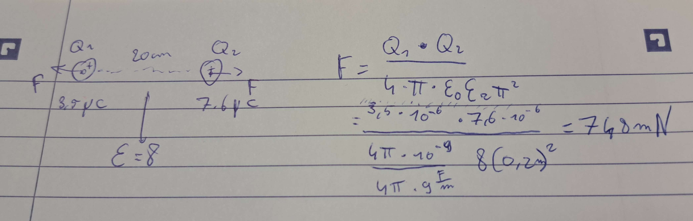
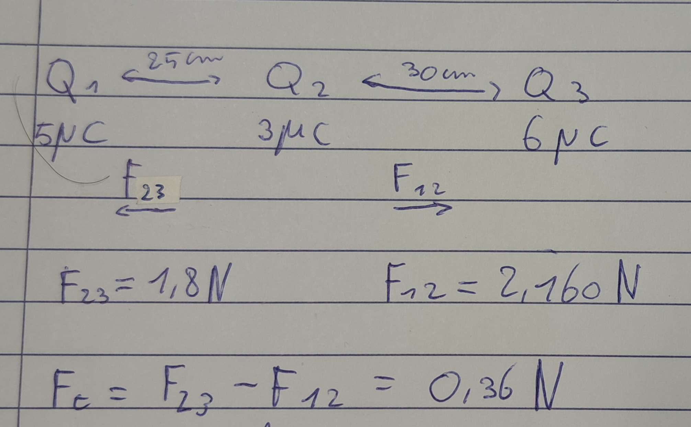
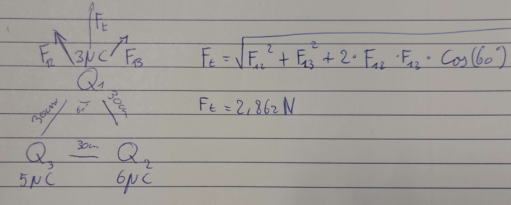

# 2 Capaciteit en condensatoren

## 2.1 Elektrostatica

### 2.1.4 Wet van Coulomb van ladingen in rust

### 2.1.5 Oefeningen op de wet van Coulomb

#### 2.1.5.1 Opgave 1

#### 2.1.5.1 Opgave 2

#### 2.1.5.1 Opgave 3

